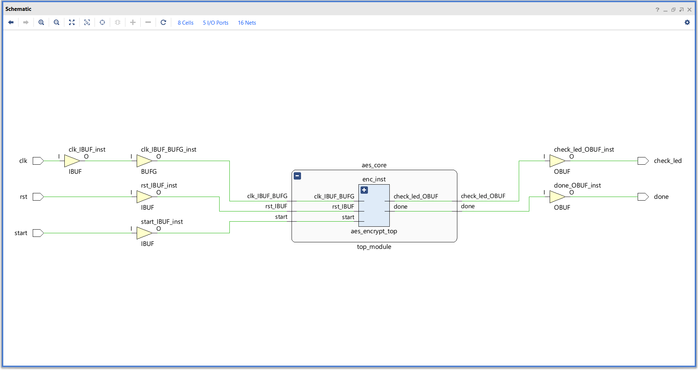
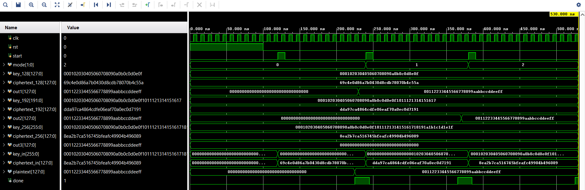

# saipraneeth048-AES-Encryption-Verilog
# 🔐 AES-128 / 192 / 256 Encryption Core in Verilog HDL

A fully synthesizable, FSM-driven AES (Advanced Encryption Standard) encryption core 
supporting all three key sizes — 128-bit, 192-bit, and 256-bit — designed in Verilog HDL, 
verified against NIST FIPS-197 test vectors, and implemented on Xilinx Artix-7 FPGA.

---

## 🎯 Project Highlights
- ✅ Multi-mode AES core (128 / 192 / 256-bit keys) selectable via `mode[1:0]`
- ✅ FSM-driven top-level controller with `start`, `done`, `reset` handshake
- ✅ **3/3 NIST FIPS-197 test vectors PASSED** for all key sizes
- ✅ **Zero DRC violations | Zero failing timing endpoints**
- ✅ Met setup AND hold timing (+3.805 ns WNS, +0.260 ns WHS)
- ✅ Low resource utilization: 5% LUTs, 1% FFs on Artix-7

---

## 🛠️ Tools & Technology Stack
| Component | Detail |
|-----------|--------|
| HDL | Verilog |
| Tool | Xilinx Vivado 2023.1 |
| Target FPGA | Artix-7 `xc7a35tcpg236-1` (Basys 3 board) |
| Verification | NIST FIPS-197 standard test vectors |
| Flow | RTL Design → Simulation → Synthesis → Implementation → STA → Power Analysis |

---

## 🏗️ Architecture

### Top-Level I/O
| Signal | Width | Direction | Description |
|--------|-------|-----------|-------------|
| `clk` | 1 | Input | System clock |
| `rst` | 1 | Input | Active-high reset |
| `start` | 1 | Input | Initiates encryption |
| `mode[1:0]` | 2 | Input | 00=AES-128, 01=AES-192, 10=AES-256 |
| `key_in[255:0]` | 256 | Input | Encryption key |
| `plaintext[127:0]` | 128 | Input | Input data block |
| `ciphertext[127:0]` | 128 | Output | Encrypted output |
| `done` | 1 | Output | Encryption complete flag |

### Schematic

---

## ✅ Functional Verification — NIST Test Vectors

All three AES modes verified against **official NIST FIPS-197 test vectors**:

| Mode | Plaintext | Key | Generated Ciphertext | Result |
|------|-----------|-----|----------------------|--------|
| AES-128 | `00112233445566778899aabbccddeeff` | `000102030405060708090a0b0c0d0e0f` | `69c4e0d86a7b0430d8cdb78070b4c55a` | ✅ PASS |
| AES-192 | `00112233445566778899aabbccddeeff` | `00010203...1617` | `dda97ca4864cdfe06eaf70a0ec0d7191` | ✅ PASS |
| AES-256 | `00112233445566778899aabbccddeeff` | `00010203...1e1f` | `8ea2b7ca516745bfeafc49904b496089` | ✅ PASS |

### Simulation Waveform

---

## 📊 Implementation Results (Xilinx Vivado 2023.1)

### ⏱️ Timing Analysis — ALL CONSTRAINTS MET
| Metric | Setup | Hold | Pulse Width |
|--------|-------|------|-------------|
| Worst Slack | **+3.805 ns** | **+0.260 ns** | **+4.500 ns** |
| Total Negative Slack | 0.000 ns | 0.000 ns | 0.000 ns |
| Failing Endpoints | 0 | 0 | 0 |
| Total Endpoints | 524 | 524 | 267 |

> ✅ *"All user specified timing constraints are met."*

### 🔧 Resource Utilization (Post-Implementation)
| Resource | Utilization |
|----------|-------------|
| LUTs | 5% |
| Flip-Flops | 1% |
| I/Os | 5% |
| BUFG | 3% |

### ⚡ Power Analysis
| Component | Power |
|-----------|-------|
| **Total On-Chip Power** | **0.099 W** |
| Dynamic Power | 0.027 W (27%) |
| Static Power | 0.072 W (73%) |
| Junction Temperature | 25.5 °C |
| Thermal Margin | 59.5 °C (11.8 W) |

### Dynamic Power Breakdown
- Logic: 48% | Signals: 45% | Clocks: 7% | I/O: <1%

### Implementation Snapshots

---

## ✅ Design Quality Checks
- 🟢 **Zero DRC Violations**
- 🟢 **Zero Implementation Errors/Warnings**
- 🟢 **No Inferred Latches**
- 🟢 **Clean RTL Coding Practices** (proper sensitivity lists, complete assignments)
- 🟢 **All 524 Timing Endpoints Pass Setup & Hold**
- 🟢 **No Hold Violations** (often missed by freshers — WHS = +0.260 ns)

---

## 📚 Key Learnings & Skills Demonstrated
- RTL design with FSM-based control logic
- Hierarchical modular design methodology
- Functional verification using industry-standard NIST test vectors
- Static Timing Analysis (STA) — setup, hold, pulse width
- FPGA implementation flow: Synthesis → Place & Route → Bitstream-ready
- Resource and power optimization
- Vivado tool flow: simulation, synthesis, implementation, reporting

---

## 🚀 How to Run
1. Clone the repository:
   git clone https://github.com/saipraneeth048/AES-Encryption-Verilog.git
2. Open **Xilinx Vivado 2023.1**
3. Create new project → target FPGA: `xc7a35tcpg236-1`
4. Add source files from `src/` and `tb/`
5. Set `tb_aes_multimode.v` as simulation top
6. Run Behavioral Simulation → observe waveforms
7. Run Synthesis → Implementation → Generate Bitstream

## 📂 Repository Structure
AES-Encryption-Verilog/
├── README.md
├── src/
│ ├── top_module.v
│ ├── aes_core.v
│ ├── aes_encrypt_top.v
│ ├── key_expansion.v
│ └── sbox.v
├── tb/
│ └── tb_aes_multimode.v
├── docs/
│ ├── schematic.png
│ ├── waveform.png
│ ├── vivado_project_summary.png
│ ├── timing_report.png
│ ├── power_report.png
│ └── device_view.png
└── constraints/
└── constraints.xdc

## 👤 Author
**Sai Praneeth Polepalle**  
B.Tech, Electronics & Communication Engineering  
Sree Rama Engineering College (JNTUA), 2026  
CGPA: 8.1 / 10

📧 psaipraneeth048@gmail.com  
🔗 [LinkedIn](https://www.linkedin.com/in/sai-praneeth-polepalle)  
💻 [GitHub](https://github.com/saipraneeth048)  
📱 +91-8247249581

---

## 📜 References
- NIST FIPS-197: Advanced Encryption Standard (AES)
- Xilinx UG901: Vivado Synthesis Guide
- Xilinx UG903: Vivado Using Constraints
